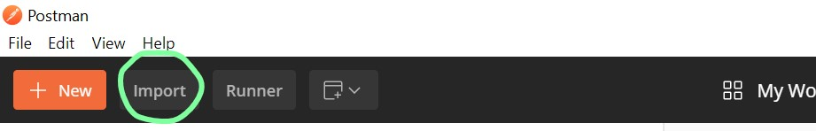
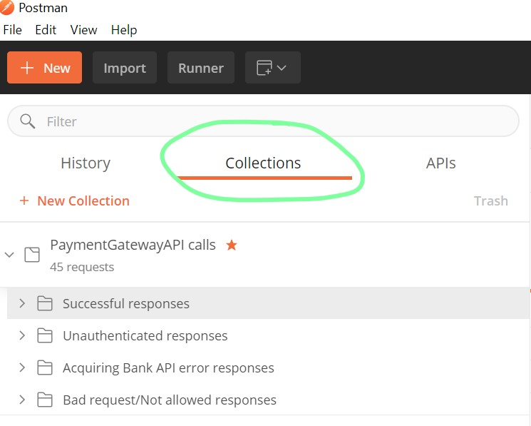
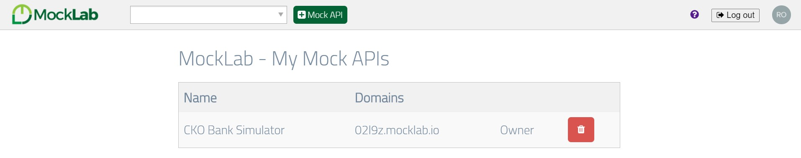
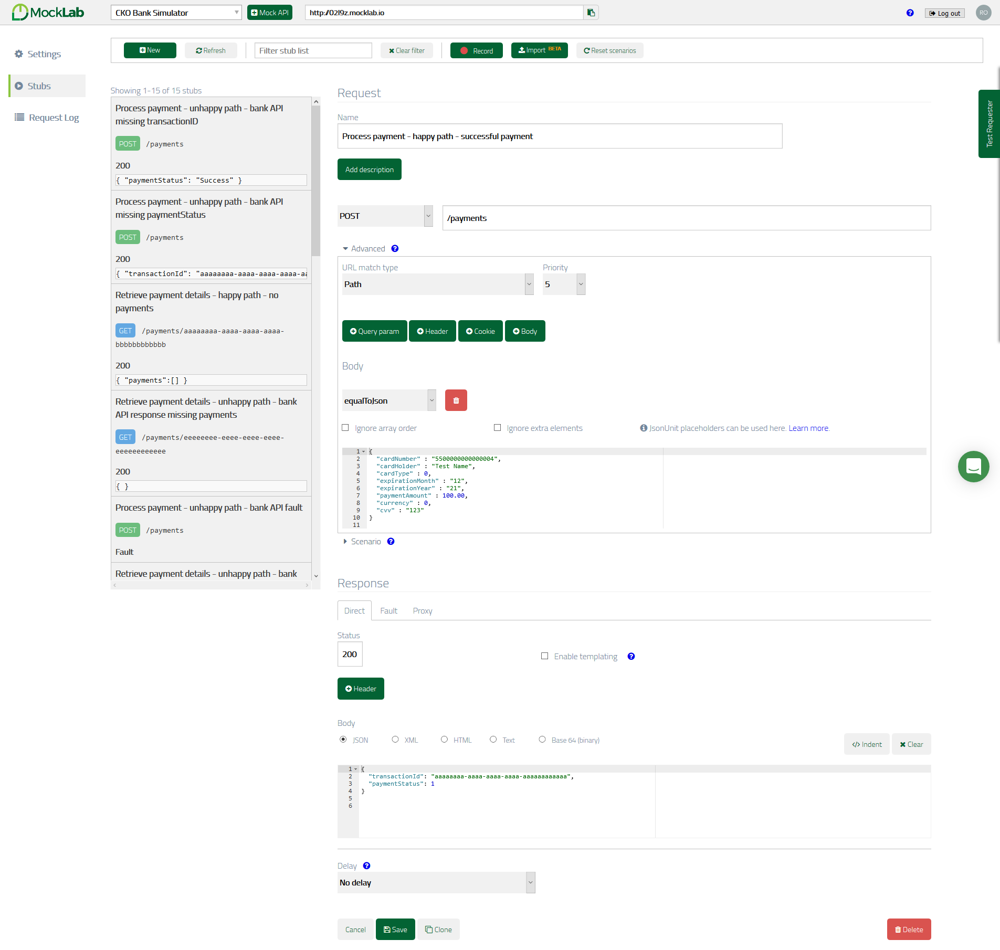
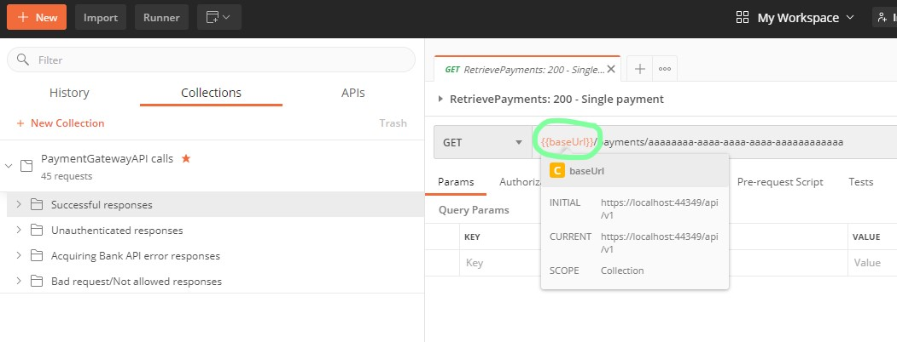
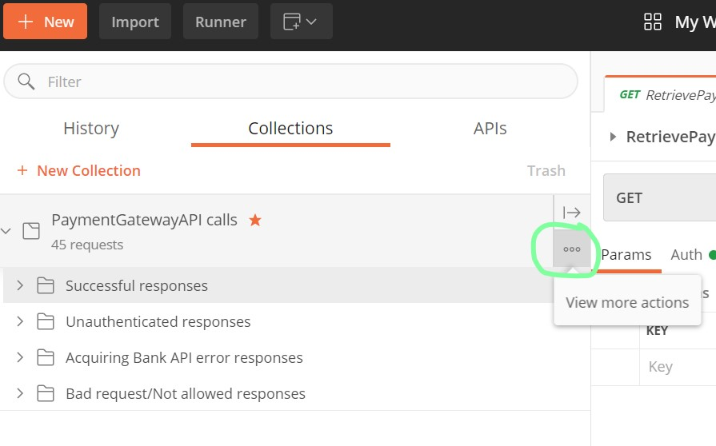
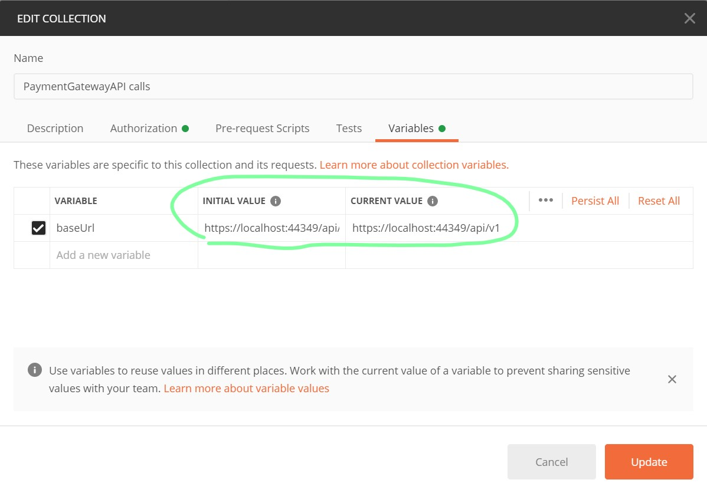
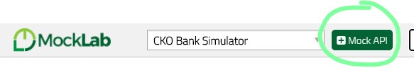
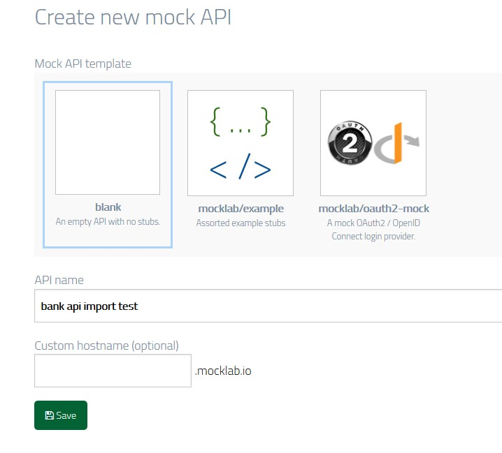
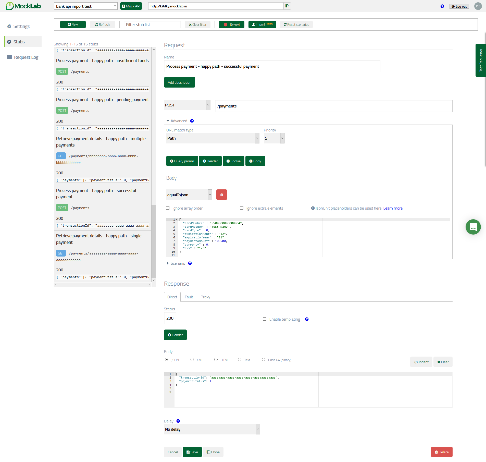

# PaymentGateway API - a complete guide
Thank you for taking the time to review my take-home assignment in relation to my recent job application.

Below you'll find a guide that should help with the setup and running of my API.

## 1. Assignment overview :man_technologist:

This repo contains both deliverables that were requested by the assignment instructions.

### The first deliverable - the PaymentGatewayAPI (Visual Studio solution)

The solution file, which can be found in this repository under `./PaymentGatewayApi/PaymentGatewayApi.sln` is a .Net Core 3.1 app split out into five projects:

Project name | Project location | Responsibility
-------------|------------------|---------------
PaymentGatewayApi | `./PaymentGatewayApi/` | The API itself and the bulk of the application.
PaymentGatewayApiTests | `./Tests/PaymentGatewayApiTests/` | The full set of unit tests for the API project.
ApiAuthentication | `./ApiAuthentication/` | A class library project that contains authentication handlers and services. It's split into its own project as I thought in a real application, this is reusable code that would be shared across multiple services.
ApiAuthenticationTests | `./Tests/ApiAuthenticationTests/` | The full set of unit tests for the ApiAuthentication project.
ApiSharedLibrary | `./ApiSharedLibrary/` | A class library project that contains common entities and resources shared by the API and the ApiAuthentication projects. 

The API uses the following external dependencies that were downloaded using NuGet:
* Serilog.Exensions.Logging.File (2.0.0) - used for file logging.
* Newtonsoft.Json (12.0.3) - used for serializing/deserializing JSON data to/from domain models.


### The second deliverable - the simulated bank
Please see the *MockLab* part of section 2 below. 

## 2. Setup and prerequisites :gear:

### Visual Studio and Docker
The API is written in .Net Core 3.1 so if you want to review the code (which I'm sure you will!) it's best done inside an IDE such as Visual Studio 2019. If you don't have Visual Studio installed, you can get it from [here](https://visualstudio.microsoft.com/vs/). The API can be built and run either in IIS Express directly from within Visual Studio or alternatively I have also provided a Dockerfile so that it can be run inside a Docker container. 

If you choose the latter option, you'll need to ensure that Docker Desktop is installed on your computer. Please visit https://docs.docker.com/desktop/ for download and installation instructions. As the API is configured to target a Linux OS Docker container, you'll also need the Linux kernel installed, but the standard Docker Desktop installation procedure provides instructions for installing this.

### Postman
Postman is my preferred tool for calling and testing my API when it's running as it effectively replaces the need to build an API client. You simply craft a response by selecting the appropriate HTTP verb (GET, POST, etc), inputting the target URL and request headers and hit 'Send'. 

To make testing the API easier, I have provided a set of pre-made API calls (known as a ***'Postman collection'***) in this repository under
 `./Tests/PostmanCollection/PaymentGatewayApi calls.postman_collection.json`. 
 
 Each call should be named in a self-describing way to indicate the expected response, but I've also provided a description for each one just in case.

If you don't already have Postman installed, you get get it from [here](https://www.postman.com/downloads/). Once installed and running, you can import my collection by clicking the 'Import' button at the top:


*A screenshot of Postman's header bar.*

You can then click Upload Files and navigate to the `.json` file mentioned above and select it. If you get a warning that says *"Unable to import as APIs when offline. These files will be imported as collections instead. Connect to the internet to import as APIs."*, this can be ignored as importing the file as a collection is the intention, so just click 'Import'.

The calls can then be accessed and viewed from the left hand side under the 'Collections' tab:

(**Note**: Before attempting to send any calls to the PaymentGateway API, please see how to get it running first in section 2).


*A screenshot of Postman's Collections tab.*

### MockLab
#### Overview

One of the deliverables of this take-home assignment was *"a simulator to mock the responses from the [aquiring] bank to test the API from your first deliverable [the payment gateway API]"*.

I decided that my preferred approach to this was to develop a set of virtual services, i.e. an API that has a set of stubs which will match the incoming request to a one of many pre-determined hardcoded reponses. In a virtual service, a given stub will always return the same response for a matched request no matter how many times you call it, even for non-idempotent HTTP verbs like POST, because the response is hardcoded.

To see why I chose to use a virtual service, see section 6 *'Assumptions and considerations'* below.

Although there are many options for this project, my virtual service platform of choice was [MockLab](https://get.mocklab.io/) due to its simplicity in creating and maintaining the API stubs.

I simply created an API and gave it a name (a domain is automatically assigned unless you specify one):


*A screenshot of the MockLab API dashboard.*

You can then start creating stubs:


*MockLab's Stubs dashboard, showing a list of stubs on the left. On the right you can name the stub, set up the pattern for the request that it matches (its HTTP verb, URL, and request body if appropriate) and hardcode a response body below. You can even add a delay to the response to simulate a slow network, or simulate a fault with the Fault tab.*

In the screenshot above, for example, I have set up a stub to simluate a successful payment response from the bank. The sub matches a POST request to *[apiURL]/payments* with the following request body:

```javascript
{
  "cardNumber" : "5500000000000004",
  "cardHolder" : "Test Name",
  "cardType" : 0,
  "expirationMonth" : "12",
  "expirationYear" : "21",
  "paymentAmount" : 100.00,
  "currency" : 0,
  "cvv" : "123"
}
```

And it will send a 200-OK response with the following body:

```javascript
{
  "transactionId": "aaaaaaaa-aaaa-aaaa-aaaa-aaaaaaaaaaaa",
  "paymentStatus": 1
}
```

#### The second deliverable - the MockLab stubs

I plan to leave the bank API up and running with a base URL of http://02l9z.mocklab.io so it can be hit when you're testing my API. I have a free account which can receive 1000 requests per month, so there should be enough for your review.

If you would like to view the stubs there are a couple of options:

* **The easy option** - I can provide my MockLab login credentials upon request. I've also sent them in my email to your recruitment team when I submitted my assignment. If you choose this option please be careful not to change the stub request/responses or it will have a knock-on effect on the PaymentGateway API.

* **The harder option** - I have exported all of my stubs as a `.json` file which can be found in this repository under `./Tests/AcquiringBankApiVirtualServices/bankapi.json`. This can be used to import into your own MockLab API if you have an account or choose to set one up. Unfortunately, one of the downsides I've encountered with MockLab whilst working on this assignment is that they have not made it super-easy to import the `.json` file into your own API. If you choose this option, please refer to the instructions at the bottom of this ReadMe in section 8 *'Appendix'*.

## 3. Building and running the API :rocket:

As mentioned above, there are two options for running the API:

* **Option 1:** It can be built and run either in IIS Express directly from Visual Studio by simply opening the solution and hitting the green *'Run'* button in the command bar, ensuring that *'IIS Express'* is selected from the drop-down bar next the button. This will open a browser window and navigate to the page *https://localhost:44349/* which is the default URL that's been configured in the `launchSettings.json` file under the `Properties` folder of the `PaymentGatewayApi` project.

* **Option 2:** Docker can be used to build and run the API in a container. This can also easily be run from Visual Studio 2019 using the same *'Run'* button, ensuring that *'Docker'* is selected from the drop-down bar. This will ensure that Docker Desktop is running and targetting the Linux OS before building and spinning up a Docker container that's running the API. A browser window will also be opened to the page *https://localhost:5001*. This URL has been configured in the `launchSettings.json` file as in Option 1. 

Once the API is up and running, you're then ready to start calling it!


## 4. Calling and testing the API :phone:

### Endpoints
The API has two endpoints:
* POST: `/api/v1/payments` - Used for processing a payment
* GET:  `/api/v1/payments/<transactionId>` - Used for retrieving details of a previous payment(s)

#### Authentication
All calls to the API will be authenticated using `Basic` Authentication. As such, the request must contain a well-formatted *Authorization* header like so: `Basic dGVzdHVzZXI6cGFzc3dvcmQx`.

This decodes to a simple username and password string: `testuser:password1` which I felt was fine for the purposes of this assignment.

#### POST requests to /payments
As well as the *Authorization* header, POST requests must also contain a request body in JSON format: e.g.

```javascript
{
  "cardNumber" : "5500000000000004",
  "cardHolder" : "Test Name",
  "cardType" : "mastercard",
  "expirationMonth" : "12",
  "expirationYear" : "21",
  "paymentAmount" : 100.00,
  "currency" : "gbp",
  "cvv" : "123"
}
```

An explanation of the expected properties in the request body is as follows. **Note that all properties are required**:

Property name | Property type | Property validation rules
--------------|---------------|---------------------------
cardNumber | string | Must be in a valid card number format - a checksum is applied to ensure this. <br> Must be either 15 (Amex) or 16 (Mastercard, Visa) digits long. 
cardHolder | string | None
cardType | int or string | Mapped to an enum in the API code. Valid values are: <br> 0 - "mastercard" <br> 1 - "visa" <br> 2 - "americanexpress"
expirationMonth | string | Must 2 digits long. <br> Must be a number between "01" and "12". <br> Depending on the year entered, it must not be in the past.
expirationYear | string | Must be 2 digits long, e.g. "20" for 2020. <br> Must be between the current year and 15 years in the future.
paymentAmount | decimal | Must be greater than 0.00.
currency | int or string | Mapped to an enum in the API code. Valid values are: <br> 0 - "gbp" <br> 1 - "usd" <br> 2 - "eur" <br> 3 - "chf" <br> 4 - "sgd" <br> 5 - "aed" <br> 6 - "hkd" <br> 7 - "brl" <br> 8 - "mur" <br> 9 - "aud" <br> 10 - nzd <br> 11 - "cad"
cvv | string | Must be between 3 and 4 digits long. <br> Must only consist of numbers.

#### GET requests to /payments/<transactionId>
As well as the *Authorization* header, GET requests **must** also contain a transactionId in the URL of the request following a `/` after payments, e.g:

`/payments/aaaaaaaa-aaaa-aaaa-aaaa-aaaaaaaaaaaa`

Property Name | Property type | Property validation rules
--------------|---------------|--------------------------
transactionId | Guid | Must be a 32 digit hyphen-separated Guid made up of hexadecimal characters <br> e.g. "12345678-abcd-1234-efab-123456789012"


#### General API response format
All calls to the API, whether POST or GET, successful or not, will receive a response in the same format:
```javascript
{
    "statusCode": "",
    "data": {}
}
``` 

Property Name | Property meaning
--------------|------------------
statusCode | An indication of the HTTP Status Code e.g. OK, Internal Server Error, Bad Request, e.g. Note that the request header will contain the actual status code itself, so the client will be able to inspect that to decide if a call was succesful. This field is more just an at-a-glance view of the request status.
data| An object to hold the response data. See below for examples.

#### Error data response format
When the API returns an error response, the `data` property will consist of an `errorCode`, `errorMessage` and `errorDescription`:

```javascript
{
    "statusCode": 401,
    "data": {
        "errorMessage": "Authentication failed: The credentials received in the Authorisation header were incorrect.",
        "errorDescription": "Please refer to the status code in the API documentation at http://paymentgateway.com/api/documentation/errors. Also see http://paymentgateway.com/api/issues to see if any know issues match your circumstances (and a timeline for their fixes).",
        "errorCode": "7890"
    }
}
```

Property Name | Property meaning
--------------|------------------
errorMessage  | A meaningful error message about what went wrong.
errorDescription | More information for the client developer about how to solve the error, including a link to a fictional webpage which holds the API documentation and more information about the errors, including known issues and a timeline for their fixes.
errorCode | A fictional internal business error code for the clients developer to use when searching the documentation for information about their error.

#### Post response format from /payments
When the API responds successfully to a POST call to `/payments`, the `data` property in the response response will contain just two properties:

```javascript
{
    "statusCode": "OK",
    "data": {
        "transactionId": "aaaaaaaa-aaaa-aaaa-aaaa-aaaaaaaaaaaa",
        "paymentStatus": "Success"
    }
}
```

Property Name | Property meaning
--------------|------------------
transactionId | A unique indentifier for the payment, returned from the acquiring bank.
paymentStatus | An indication of the status of the payment, returned from the acquiring bank. Expected responses are: `Success`, `Pending`, `FailedInsufficientFunds`, `FailedIncorrectCardDetails` and `FailedCardFrozen`.

#### GET response format from /payments
When the API responds successfully to a GET call to `/payments`, the `data` property in the response response will contain an array named `Payments`. Although just one payment is expected for a unique identifier, it's possible that the acquiring bank may return more than one, so I decided to return both in an array of payment objects:

```javascript
{
    "statusCode": "OK",
    "data": {
        "payments": [
            {
                "paymentStatus": "Success",
                "paymentDateTime": "2020-09-23T12:00:00",
                "paymentAmount": 100.00,
                "currency": "GBP",
                "cardNumber": "XXXXXXXXXXXX0004",
                "cardHolder": "Test Name",
                "cardType": "MasterCard",
                "expirationMonth": "12",
                "expirationYear": "21"
            },
            {
                "paymentStatus": "Pending",
                "paymentDateTime": "2020-09-24T12:00:00",
                "paymentAmount": 150.00,
                "currency": "CHF",
                "cardNumber": "XXXXXXXXXXXX1111",
                "cardHolder": "Test Name",
                "cardType": "Visa",
                "expirationMonth": "11",
                "expirationYear": "22"
            }
        ]
    }
}
```

Although the property names are fairly self-explanatory, here are their meanings for completeness. Note that the CVV of the payment card is not returned for security reasons:

Property name | Property meaning
--------------|-----------------
payments |  A collection of payment objects
paymentStatus | An indication of the status of the payment, returned from the acquiring bank. Expected responses are: `Success`, `Pending`, `FailedInsufficientFunds`, `FailedIncorrectCardDetails` and `FailedCardFrozen`.
paymentDateTime | The date and time that the payment took place.
paymentAmount | The amount paid.
currency | The currency code of the payment.
cardNumber | The card number used in the payment, masked for security except for the last 4 digits. (This is masked by the API code; it is returned from the Bank API unmasked).
cardHolder | The name of the card holder.
cardType | The type of payment card used: `MasterCard`, `Visa` or `AmericanExpress`.
expirationMonth | The expiration month of the payment card.
expirationYear | The expiration year of the card.


### Unit tests
Altogether, the two test projects consist of over 200 unit tests for as complete test coverage as I could think of, and these can be run from inside Visual Studio.

### Postman collection
For higher level end-to-end testing of the API, I recommend using the provide Postman collection that I described in section 2 *'Setup and prerequisites'*. To send a call to the API using the Postman collection, ensure that the API is running then simply select a call from the collection and hit *'Send'*.

Note that all of the saved calls in the collection use a `{{baseUrl}}` variable at the start of their URL:


*The Postman collection's baseUrl variable.*

This is currently set at a collection level to `https://localhost:4449/api/v1` as I mainly used the IIS Express method of running the app. If you wish to run the API inside a Docker container instead, this `{{baseUrl}}` value can be edited by first clicking the elipsis symbol next to the the collection header itself to *View more actions*:


*The Postman collection's 'View more actions' button.*

Then select *Edit* and click on the *Variables* tab when the *Edit Collection* window opens up. Here you can update the *Initial Value* and *Current Value* strings to the URL at which you're running the API, either locally or in a container:


*Editing the Post collection's baseUrl variable value.*

Alternatively, you can edit the URL of an individual call simply by typing in its URL bar.

## 5. Bonus tasks :star:

I have attempted to tick off a few of the optional bonus tasks in the course of working on this project, add features that you would expect with a modern API.

### :white_check_mark: Logging
I implemented simple `.txt` file logging using Serilog's `Serilog.Exensions.Logging.File` NuGet package which was simple to configure and call. The logs can be found under `./PaymentGatewayApi/logs` when the application runs. Different log levels are configured via settings in the two `appSettings.json` variants. For example, in Production, only messages of level `Error` and higher will be logged to prevent the files from getting too 'noisy'. 

If this was a Production app, I would most likely use a different sink instead of text files, such as [SEQ](https://datalust.co/seq) which Serilog can connect to and allows for far better organisation, filtering and searching of logs.

### :white_check_mark: Authentication
I implemented `Basic` authentication for the API and this lives in a separate project under `./ApiAuthentication`. It consists of a handler which checks the request for an `Authorization` header, decodes it into username and password strings and passes these into a dummy implementation of `ApiAuthentication.IAuthenticationService` for varification. This dummy implementation simply does a string comparison against some hardcoded values, but in a real API they would be checked against a database, real authentication service, or perhaps CI/CD pipleine secrets.

### :white_check_mark: API Client
Rather than build a client myself from scratch, I have provided an API client in the form of a Postman collection of around 45 pre-saved service calls which are part of this repository under `./Tests/PostmanCollection`. I hope this makes the job of testing my API a lot easier!

### :white_check_mark: Containerization
I'm quite new to containerization but I understand it's many advantages and wanted to give it a try. The API contains a Dockerfile under `./PaymentGatewayApi/Dockerfile` which contains the configuration to build and run the app inside a Docker container.  Please see the instructions in sections 2 and 3 for doing this.

### :negative_squared_cross_mark: Data storage
I attempted to added this in the way of response caching but ran into problems - see 'Considerations' below.

## 6. Assignment assumptions, considerations and trade-offs :thinking:

Below are my assumptions and considerations throughout working on this assignment.
### Simulating the aquiring bank API
I decided to use a virtual service to stub the Bank API as it had two distinct advantages when it came to writing the PaymentGateway API:
1. I stored the URL of the virtual service in the API project's `appSettings.json` file, meaning that it can be easily swapped out for any other virtual service platform very easily just by changing the URL.

2. The `appSettings.json` file is broken down into a Development and Production version, namely `appSettings.Development.json` and `appSettings.Production.json`. This allows me to specify a separate acquiring bank API URLs for each environment. ie. in `appSettings.Production.json` I can point to a real bank API and in Production, the PaymentGateway would call this without any code changes required.
(Note that in the absence of a real bank API URL, I've just used a fake placeholder in that file).

### Pagination, filtering, sorting for the GET request
I considered adding this functionality via the URL of the request but seeing as the transactionId parameter should, from a business-perspective, match to just one payment (although it's technically possible that more can be returned), I decided to not include this. In a larger production API, this would be a useful feature to include if multiple results are expected from a GET request.

### Plural names in the URL
On a similar note to the point above, I decided to use `/payments` instead of `/payment` to follow best-practise guidance, as in theory the resources being accessed/created are multiple rather than singular. Also, if the API was later extended to create/update/retrieve multiple records in one call, it semantically makes more sense to use the plural, whilst `GET /payments/{transactionId}` still makes sense for a single item.

### Error codes and documentation
Although many of the `errorDescription` properties say to use the `errorCode` property to search the API documentation for help diagnosing the error, this is fictional. In production though, it would of course be real.

### Duplicate checking on POST /payments
In a real world API, to ensure that duplicate payments cannot be processed, a check would be needed either by the Payment Gateway as a separate call to the bank API or within the bank API itself. It's entirely possible that the shopper could place two payments using the same card and for the same amount, so some business logic would be needed to assess how far apart in time these calls were made and decide if the merchant is accidentally trying to request duplicate payment. However, as my API has no data storage facility and the responses from the Bank API are hardcoded, I did not include this.

### Caching
On the topic of data storage I did try to implement the bonus task *Data storage* by way of simple response caching using [this guide](https://medium.com/@dale.bingham_30375/adding-response-caching-to-your-net-core-web-apis-quickly-3b09611ae4f5) and .NET Core response-caching middleware. My intention was to use it to increase the performance of the GET request - if it receives a transactionId that it's already processed before, it could return a cached response as the data will not have changed. However, according to [Microsoft's documentation](https://docs.microsoft.com/en-us/aspnet/core/performance/caching/middleware?view=aspnetcore-3.1#conditions-for-caching), this cannot be used on controller actions that are already decorated with the `Authorize` attribute, and both of mine are. If I had more time, I would have explored other caching options such as Redis.

### Api versioning
In line with best-practises, I have included URL-based versioning with this API, starting at v1, so that the full URL is `{{baseURl}}/api/v1/{{endPoint}}`. If no version number is present in a request URL, it will default to v1. I included versioning so that in the future, changes can be made to the API and they can be published to e.g. `{{baseURL}}/api/v2/{{endPoint}}` without breaking the existing API for clients who do not move to the new version straight away. This would have increased hosting cost implications whilst both the old and new versions are live, but the cost of angry customers would most likely be higher! :smile:

### Expiration month and year fields
I decided to keep these as separate fields because in almost every shopping payment page I can remember using, they are separate, and I didn't feel that the onus should be placed on the merchant/API client to merge them into a single formatted string to call my API. It made the validation a little harder when checking if the combination of month and year were in the past, but I got a working solution in the end. 

### DTO mapping
I decided to keep separate DTO models for the simulated Bank API requests and responses because even though this meant having to map them to/from the PaymentGateway API DTO models, it allows for looser coupling between the two APIs. This means that if the Bank API decided to change its request/response format, although the mapping code would need to be updated (or better yet, a new implementation of the mapping code written and injected), it means the API clients wouldn't have to update their models as PaymentGateway API's DTOs would remain unchanged.

### Code reusability
In an effort to adhere to DRY I moved the `ModelState.IsValid` checks to a custom action filter named `[ModelValidation]` that's reusable across all action methods and easier to test in isolation. I did consider using the built-in `[ApiController]` attribute on the controller which also performs this check but I wanted greater control over the format of the response, so that all responses, whether they're 400-Bad Request or otherwise would be returned in a consistent format.

I also have a single area for catching and handling unexpected exceptions - a `GlobalExceptionMiddleware` class. I felt that this was a better approach to wrapping many methods in `try-catch` blocks.

### Shared projects
Finally, when I added in authentication to the API, I decided that it should be in its own project as it composed of several classes and it would make a good candidate for code that's shared across multiple APIs. If this API was to grow further or make up part of a microservice architecture, I would consider moving more items, such as the banking API service code and custom middleware, out into their own shared class library projects as I did with `ApiSharedLibrary` to promote code re-use.

## 7. Algorithmic complexities :nerd_face:

Overall, I did not have to write any looping algorithms throughout this assignment with the exception of the method `MaskString()` in `PaymentGatewayApi.Mappers.DtoMapper`, which is designed to take an input string and replace all but the final specified number of characters with 'X'. i.e. useful for masking payment card numbers.

This method iterates over each character in the input string just once giving it a time complexity of *O(n)*. When doing so, it writes to a `StringBuilder` which is an efficient way of concatenating a string in .Net. If I has just used a `+=` operator, under the hood I believe this creates a new copy of the string each time, which would increase the space complexity. All in all though, as a card number is unlikely to be more than 15-16 characters, the efficiencies are negligle as it's not dealing with a huge collection of items.

## 8. Appendix :scroll:

### Importing the MockLab API stubs
To get started you'll need to first create a MockLab account if you don't already have one, and then create an API on MockLab into which you plan to import the stubs:


*Creating a new MockLab API - part 1.*

Select the blank template, give it name and hit *Save*:


*Creating a new MockLab API - part 2.*

Once that's made, for simplicity, go into the  *Settings* on the left-hand side and temporarily turn off Admin Security (just for the import - turn it back on afterwards). Also make a note of your API's base url as you'll need this for the next step:


*Disabling your MockLab API Admin Security.*

Finally, use the following *CURL* command to POST the contents of the `.json` export file to your API, ignoring the square brackets. ***Note**: On Windows 10, Git Bash can be used to perform CURL commands*:

```
curl -v -d @'[json file location on your machine]' https://[your API's base url].mocklab.io/__admin/mappings/import
```
e.g. for my new API in the screenshots above, which has a URL of `https://k9dky.mocklab.io` and my export file named `bankapi.json` is stored in the `Downloads` folder on my PC, the *CURL* command would look like so:
```
curl -v -d @'C:\Users\Rob\Downloads\bankapi.json' https://k9dky.mocklab.io/__admin/mappings/import
```
And as if by magic, the stubs should then all appear in your MockLab API's *Stubs* tab!


*The imported stubs in the new MockLab API*

Enjoy! :grin: